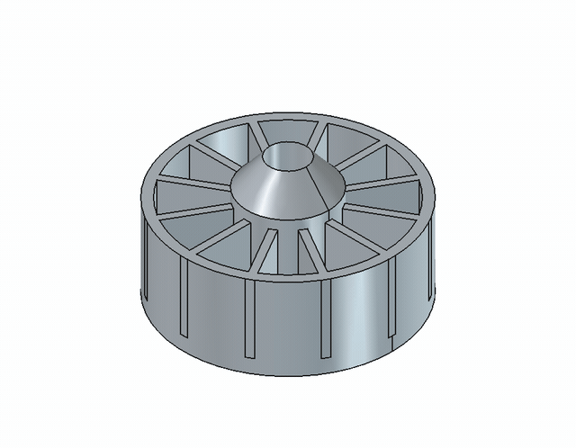

# FreeCADTool — Parametric CAD for AI Agents



**FreeCADTool** is a pure C# / .NET agent plugin that lets an AI agent create and edit real
parametric 3D CAD models inside [FreeCAD](https://www.freecad.org): primitives, PartDesign
bodies with sketches, pad / pocket / revolve / groove / hole / loft / sweep, linear / polar /
mirror patterns, fillet / chamfer, boolean fuse / cut / common, and import / export of the
standard CAD formats (STEP, STL, 3MF, OBJ, IGES). It is the C# counterpart of the
`freecad-AI` MCP server, reshaped into one structured, deterministic agent tool.

The animation above is a turbine impeller — a 12-blade rotor with a revolved hub, top cap,
mounting flange, outer shroud, central bore and a bolt circle — built as a single solid and
rendered by orbiting the FreeCAD camera. Every frame is a real FreeCAD render, not a mockup.

## What it is (and is not)

FreeCADTool does **not** contain a CAD kernel. It drives a running **FreeCAD** instance over a
local RPC bridge (the same bridge `freecad-AI` uses). FreeCAD is an external engine — not a
compile-time dependency and not a NuGet wrapper. The plugin itself is pure, managed .NET with
**no native or non-.NET dependencies of its own**, so it loads cleanly into any
[AIOrchestrator](https://github.com/Graphene-Lab) host (AgentBridge, AIOffice).

| | |
|---|---|
| **Language** | C# / .NET 10 (`AnyCPU`, OS-neutral) |
| **Engine** | FreeCAD 1.x and 0.20.x (Part + PartDesign + Sketcher) |
| **Transport** | JSON-RPC over TCP `127.0.0.1:9876` |
| **Platforms** | Windows · Linux · macOS |
| **Scope** | CAD core: primitives, bodies, sketches, features, patterns, edge ops, booleans, import/export, view |
| **License** | AGPL-3.0 |

## How it works

```
FreeCADTool (C#)  ──JSON-RPC──▶  FreeCAD + bridge (TCP 127.0.0.1:9876)
                                       │
                                       └─ FreeCAD's own Part / PartDesign / Sketcher engines
```

The plugin sends a small, purpose-built Python snippet per operation to the bridge and reads back
a structured result. The agent never sees or writes Python — it calls typed methods and gets
plain-text results (or a deterministic `Error: …` string).

### Setup: install FreeCAD and start the bridge

1. **Install FreeCAD** (1.1.x recommended; 0.20.x also supported) from
   <https://www.freecad.org/downloads>. On Linux: `sudo apt install freecad`.
2. **Start the bridge** so the tool has something to talk to:
   - **Headless (automation):** `freecadcmd bridge_headless.py` — no GUI needed; runs the full
     modeling surface.
   - **GUI (screenshots / view control):** `freecad startup_bridge.py` — starts the bridge
     inside the FreeCAD GUI so `view` operations work too.
3. The plugin connects to `FREECAD_HOST`:`FREECAD_PORT` (defaults `127.0.0.1:9876`). Call
   `status()` first to confirm the connection, the FreeCAD version, and whether the GUI is up.

## Agent methods

Fixed value sets (the `action` / `operation` / `kind` parameters) are **C# enums**, not free
strings — the agent is shown the exact allowed values and any value outside the set is rejected
before the method runs.

| Agent method | Purpose |
|---|---|
| `status()` | Report the FreeCAD connection, version, and whether the GUI is available. Call first. |
| `document(action, name, path)` | `List` \| `Create` \| `Open` \| `Save` \| `Close` \| `Recompute`. |
| `list_objects(docName)` | List objects (name, label, type). Source of names for every other method. |
| `inspect_object(name, docName)` | One object's properties and shape metrics (volume, area, validity, counts). |
| `delete_object(name, docName)` | Remove an object (undoable). |
| `create_primitive(kind, properties, name, docName)` | `Box` \| `Cylinder` \| `Sphere` \| `Cone` \| `Torus` \| `Wedge` \| `Helix`. |
| `create_object(typeId, name, properties, docName)` | Any FreeCAD object type by id. |
| `edit_object(name, properties, docName)` | Set properties on an existing object. |
| `transform(name, position, rotation, scale, docName)` | Move, rotate and/or scale an object. |
| `boolean(operation, objectNames, name, docName)` | `Fuse` \| `Cut` \| `Common` of solids. |
| `export(format, path, objectNames, docName)` | `step` \| `stl` \| `3mf` \| `obj` \| `iges`. The file is versioned after writing. |
| `import_file(path, docName)` | Import a CAD file into the document. |
| `undo_redo(action, docName)` | `Undo` \| `Redo` \| `Status`. `Undo`/`Redo` need the GUI (no-op in headless); `Status` works anywhere. |
| `create_body(name, docName)` | A PartDesign Body — the container for feature-based modeling. |
| `sketch(action, sketchName, body, plane, properties, docName)` | `Create` \| `Rectangle` \| `Circle` \| `Line` \| `Arc` \| `Point`. |
| `feature(action, sketch, body, properties, docName)` | `Pad` \| `Pocket` \| `Revolve` \| `Groove` \| `Hole` \| `Loft` \| `Sweep` from a sketch. |
| `pattern(action, feature, body, properties, docName)` | `Linear` \| `Polar` \| `Mirror` pattern of a feature. |
| `edge_op(operation, baseObject, edges, size, docName)` | `Fillet` \| `Chamfer` edges of a solid. |
| `create_gear(properties, name, docName)` | Parametric involute gear (spur/helical) via the FCGear workbench — needs that add-on installed; clear error otherwise. |
| `view(action, path, properties, docName)` | `Screenshot` \| `Angle` \| `Fit` \| `Zoom` \| `Visibility` \| `DisplayMode` \| `Color` (needs the GUI). |

Typical agent flow:

```
status()
→ document(Create, "part")
→ create_body("b")
→ sketch(Create, "sk", "b", "XY_Plane")
→ sketch(Rectangle, "sk", properties={"x":0,"y":0,"width":20,"height":10})
→ feature(Pad, "sk", "b", {"length": 10})
→ export("step", "/out/part.step")
```

## Ready-made parts (without drawing them)

You usually do **not** need a dedicated "fetch a part" method. The clean, format-based path is
already built in: download a standard part from any public CAD archive (McMaster-Carr, Traceparts,
GrabCAD, the FreeCAD part libraries, etc.) as **STEP / IGES / STL / OBJ** and bring it in with
`import_file(path)`. It lands in the active document as an editable object you can then
`transform`, `boolean`, `export`, or use as a reference.

Parametric standard parts the tool can generate itself — bolt circles, washers, spacers, flanges,
and a simple toothed wheel (a base cylinder plus a `Polar` pattern of teeth) — are built with the
existing primitives + patterns + booleans, so they stay version-independent and need nothing
installed.

**Gears: `create_gear` via FCGear.** For real involute / helical gears the tool offers one
workbench call-through: `create_gear(properties)` drives the
[FCGear](https://github.com/looooo/freecad.gears) workbench (`CreateInvoluteGear`) with
`teeth`, `module`, `height`, `pressure_angle`, `helix_angle`, `shift`, `axle_hole`, etc. This is
a *call-through*, not a bundle: the plugin ships **zero** FCGear code — it sends a snippet that
calls the workbench already installed in the user's FreeCAD, so FCGear's GPL-3.0 license never
enters the plugin's distribution. FCGear's headless path is proven by its own CI, and the gear
build is verified here on FreeCAD 1.1.x and 0.20.x. If the add-on is not installed the method
returns a clear `Error:` (install it from the FreeCAD Addon Manager, or fall back to the
primitive + `Polar` pattern above).

**Why the other part workbenches are not wrapped.** The Fasteners workbench
(`FreeCAD_FastenersWB`) and BOLTS / BOLTSFC are excellent but a poor fit as core methods: the
Fasteners headless path is fragile (a top-level `import FreeCADGui`) and its scripted API is
awkward, and BOLTS is GUI-oriented and largely superseded — neither is dependable under
`freecadcmd`. CadQuery is a separate Python CAD library with no free C#/.NET package, so it is
out of scope for a pure-.NET tool. The supported pattern stays: **import the part file, build it
parametrically with the methods above, or use `create_gear` for gears.**

## Cross-platform

The plugin is OS-neutral (`AnyCPU`, no runtime identifier) and runs wherever .NET runs. The
FreeCAD engine it drives is available on Windows, macOS and Linux, so the whole tool works on all
three. The transport is plain TCP and JSON, with no OS-specific code. The full method surface is
verified against FreeCAD 1.1.x (Windows) and 0.20.x (Linux) in the test harness.

## GUI-only features

`view` screenshot, visibility, display mode and color need a FreeCAD GUI session. So do
`undo_redo(Undo)` and `undo_redo(Redo)`: FreeCAD's undo stack is driven by the GUI, and in
headless mode `doc.undo()` is a silent no-op, so the tool raises a clear `Error:` rather than
pretending to revert. `undo_redo(Status)` works anywhere and reports whether the GUI is up.
Everything else — modeling, booleans, patterns, edge operations, import/export — works fully
headless.

## What was reshaped from `freecad-AI`

- The many code-generating MCP tools are merged into a small, structured method surface: no raw
  `execute_python` is exposed to the agent. Each method maps to a concrete CAD operation.
- Fixed value sets are C# enums, so the allowed values are part of each method's signature and
  the generated tool scheme.
- Adapted to the agent-tool contract: `BaseAgentTool`, namespace `AIOrchestrator.API`,
  agent-oriented XML docs, `Log.LogStep` tracing, sandbox path handling, version-before-write.
- Deterministic `Error: cause — detail` strings on every failure path instead of raw exceptions.
- Scope is the CAD core. Draft and Spreadsheet are intentionally out of scope.

## Development

```bash
dotnet build FreeCADTool.csproj
# start a headless FreeCAD bridge (needs FreeCAD installed), then:
dotnet run --project FreeCADTool.Harness   # end-to-end checks against the live bridge
```

The harness runs the full CAD-core surface (primitives, booleans, sketch + pad/pocket/revolve,
patterns, fillet/chamfer, transform, edit, undo/redo, export/import) and prints one line per
check, ending with a pass/fail total.

## Release

Push a tag `v*` (date version, e.g. `v1.26.09.15`) — the two workflows publish both channels:

- `plugin-release.yml` → GitHub Release with the self-contained `FreeCADTool-<version>.zip`,
  which the hosts (AgentBridge, AIOffice) install into `Tools/FreeCADTool/`.
- `publish.yml` → NuGet package `Graphene.FreeCADTool` (the repository needs the
  `NUGET_API_KEY` secret — same key as the other Graphene-Lab repos).

A plain push is a code-only sync and publishes nothing. The repository must stay **public**
(the hosts download the release zip anonymously).

## License

[GNU Affero General Public License v3.0](LICENSE.md)
